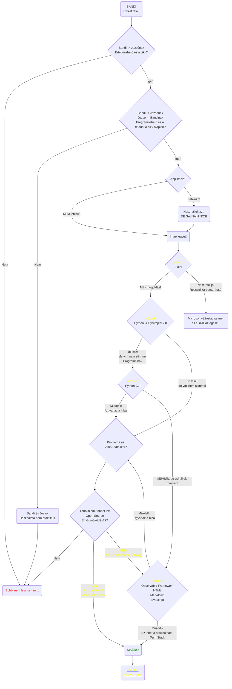

# Ellenőrző bemutató

Nézzük meg, működik-e!?

## Technológia (tervezett)

Alkalmazott full-stack:
<ol>
  <li>Front-end:
    <ol>
      <li>tipográfia
        <ol>
          <li>markdown</li>
          <li>HTML</li>
          <li>css (src/custom-style.css)</li>
        </ol>
      </li>
      <li>grafikus lehetőségek
        <ol>
          <li>ObservableHQ</li>
          <li>d3.js</li>
        </ol>
      </li>
    </ol>
  </li>
  <li>Back-end:
    <ol>
      <li>javascript</li>
      <li>vagy más!?</li>
    </ol>
  </li>
</ol> 

## Tipográfia (minimal teszt)

  Tipográfia teszt:
  <!--Árvíztűrő tükörfúrógép.<br-->
  Á
  r
  v
  í
  z
  T
  ű
  r
  ő
  -
  T
  ü
  k
  ö
  r
  F
  ú
  r
  ó
  g
  é
  p

## A folyamat eddig - lépések/döntések

