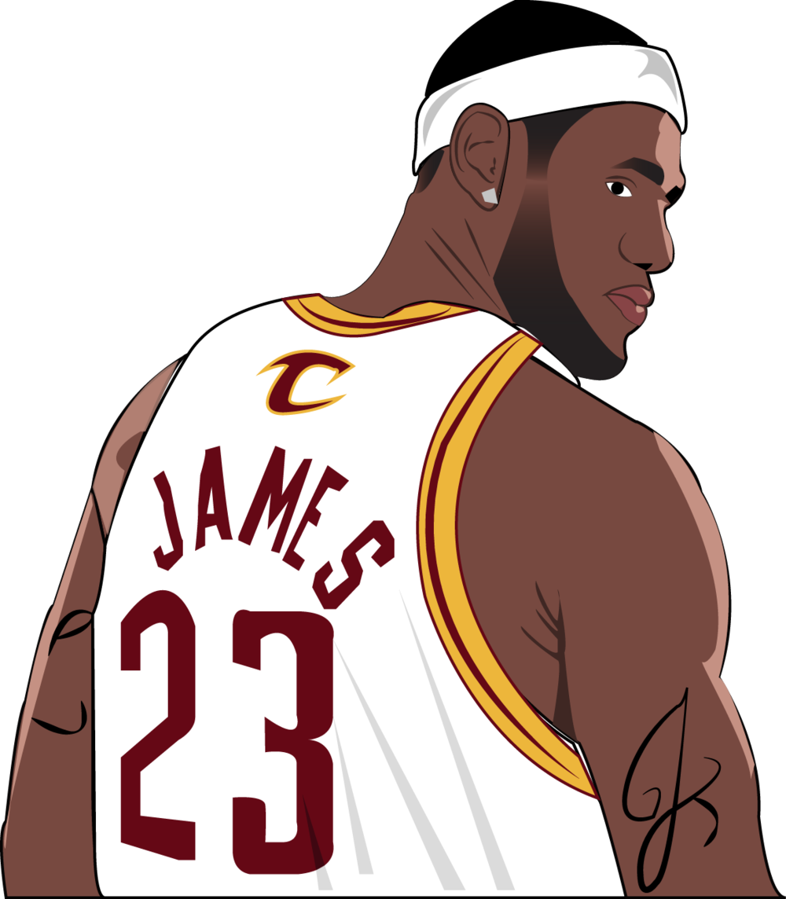

<!--div class="hero"-->
<div class="hero">
  <h1>KosAk</h1>
</div>


```js
// shots_awk_00.csv
// shots.csv
const shots = FileAttachment("data/shots_awk_00.csv").csv({typed: true});
//const shots = FileAttachment("data/shots.csv").csv({typed: true});
```
```js
function markings({
  stroke = "currentColor",
  strokeWidth = 1,
  strokeOpacity = 1
} = {}) {
  // Ref. https://observablehq.com/@nor/nba-2018-19-shooting-effeciency
  const angle = Math.atan(90 / 220);
  const arc = d3.arc();
  const lines = [
    [-250, 420, 250, 420], // half
    [-250, 450, -250, -50], // left
    [250, 450, 250, -50], // right
    [250, -50, -250, -50], // bottom
    [-220, -50, -220, 90], // corner 3
    [220, -50, 220, 90], // corner 3
    [-80, -50, -80, 140], // paint
    [80, -50, 80, 140], // paint
    [-60, -50, -60, 140], // paint
    [60, -50, 60, 140], // paint
    [-80, 140, 80, 140], // free throw line
    [-30, -10, 30, -10], // backboard
    [0, -10, 0, -7.5], // rim
    [-40, -10, -40, 0], // ra
    [40, -10, 40, 0] // ra    
  ];
  const circles = [
    [0, 0, 7.5],  // rim
    [0, 140, 60],  // key
    [0, 420, 20],  // center court inner
    [0, 420, 60]  // center court outer
  ];
  const arcs = [
    [0, 0, 40, -Math.PI * 0.5, Math.PI * 0.5], // ra
    [0, 0, 237.5, -Math.PI * 0.5 - angle, Math.PI * 0.5 + angle] // 3pt
  ];
  return (index, {x, y}) => {
    return htl.svg`<g fill=none stroke=${stroke} stroke-width=${strokeWidth} stroke-opacity=${strokeOpacity}>
      ${lines.map(([x1, y1, x2, y2]) => htl.svg`<line x1=${x(x1)} x2=${x(x2)} y1=${y(y1)} y2=${y(y2)}>`)}
      ${circles.map(([cx, cy, r]) => htl.svg`<ellipse cx=${x(cx)} cy=${y(cy)} rx=${Math.abs(x(r) - x(0))} ry=${Math.abs(y(r) - y(0))}>`)}
      ${arcs.map(([cx, cy, r, a1, a2]) => htl.svg`<path d="M${x(cx + r * Math.cos(a1 - Math.PI / 2))},${y(cy + r * Math.sin(a1 - Math.PI / 2))}A${Math.abs(x(r) - x(0))} ${Math.abs(y(r) - y(0))} 0 0 ${Math.sign(x(r) - x(0)) * Math.sign(y(r) - y(0)) > 0 ? 0 : 1} ${x(cx + r * Math.cos(a2 - Math.PI / 2))},${y(cy + r * Math.sin(a2 - Math.PI / 2))}">`)}
    </g>`;
  };
}
```

```js
const startview = Inputs.date({label: "Kezdő dátum", min:"2003-01-01", max:"2024-12-31", value: cxm_start})
//const start = view(Inputs.date({label: "Kezdő dátum", min:"2003-01-01", max:"2025-01-01", value: cxm_start}))
const endview = Inputs.date({label: "Időtartam vége", min:"2003-01-01", max:"2024-12-31", value: cxm_end})
//const end = view(Inputs.date({label: "Időtartam vége", min:"2003-01-01", max:"2025-01-01", value: cxm_end}))
const start = view(startview)
const end = view(endview)
```
```js
const xview = Inputs.range([2003, 2023], {label: "Melyik év:", step: 1, value: 2003});
const x = view(xview);
```

```js
const LeBron_image = FileAttachment("./data/lebron.png").image({width: 120})
// style="float:right;"
```
<!--div class="grid grid-cols-2"-->
<div class="grid grid-cols-2">
	<div class="card" style="font-size: 20px; text-align:center">
		<h2 style="font-size: 20px;"> LeBron James Shooting</h2>
		<div style="float:left;">
			${LeBron_image}
		</div>
		<div style="float:right;">
				<br /><br />
			2003-2024
				<br /><br />
		</div>
	</div>
	<div  class="card" style="justify-content: center">
		<br />
		${view(startview)}
		<br />
		${view(endview)}
	</div>
</div>

<div class="center">
	Amikor vannak jó adataink és jól bánunk velük, akkor ilyesmikre leszünk képesek.
	<br />
	Állítsátok be a kérdéses évet és meglátjuk miket/honnan dobot!?
</div>

<!-- x = ${x} to markdown

-->
```js
const cxm_start = x +'-01-01'
const cxm_end = (x + 1) +'-01-01'
```
<div class="card" style="max-width: 640px; margin: auto">
${view(xview)}
${resize((width) => Plot.plot({
    //width: 600,
    height: 640,
    axis: null,
    x: {domain: [-250, 250]},
    y: {domain: [-50, 450]},
    color: {type: "log", scheme: "ylgnbu", legend: true, label: "sikeres kosár"},
    marks: [
      Plot.rect(shots, Plot.bin({fill: "count"}, {x: "loc_x", y: "loc_y", filter: d => +d.shot_made_flag && d.game_date >= start && d.game_date <= end, inset: 0, interval: 5})),
      Plot.gridX({interval: 5, strokeOpacity: 0.05}),
      Plot.gridY({interval: 5, strokeOpacity: 0.05}),
      markings()
    ]
  }))}
</div>

---
<style>

.hero {
  display: flex;
  flex-direction: column;
  align-items: center;
  font-family: var(--sans-serif);
  margin: 1rem 0 1rem;
  text-wrap: balance;
  text-align: center;
}

.hero h1 {
  margin: 0rem 0;
  padding: 0rem 0;
  max-width: none;
  font-size: 14vw;
  font-weight: 900;
  line-height: 1;
  background: linear-gradient(30deg, var(--theme-foreground-focus), currentColor);
  -webkit-background-clip: text;
  -webkit-text-fill-color: transparent;
  background-clip: text;
}

.hero h2 {
  margin: 0;
  max-width: 34em;
  font-size: 20px;
  font-style: initial;
  font-weight: 500;
  line-height: 1.5;
  color: var(--theme-foreground-muted);
}

  .center {
  display: flex;
  align-items: center;
  justify-content: center;
    text-align: center; /*  center out item horizontally  */
  }
  
  .box-2 {
    width: ${width}px;
    display: flex; /* make the container div to make it a flex item. */
    justify-content: center; /*  center out item horizontally  */
  }
  .box-2 h2 {
    display: inline-block;
  }
  
@media (min-width: 640px) {
  .hero h1 {
    font-size: 90px;
  }
}

</style>
